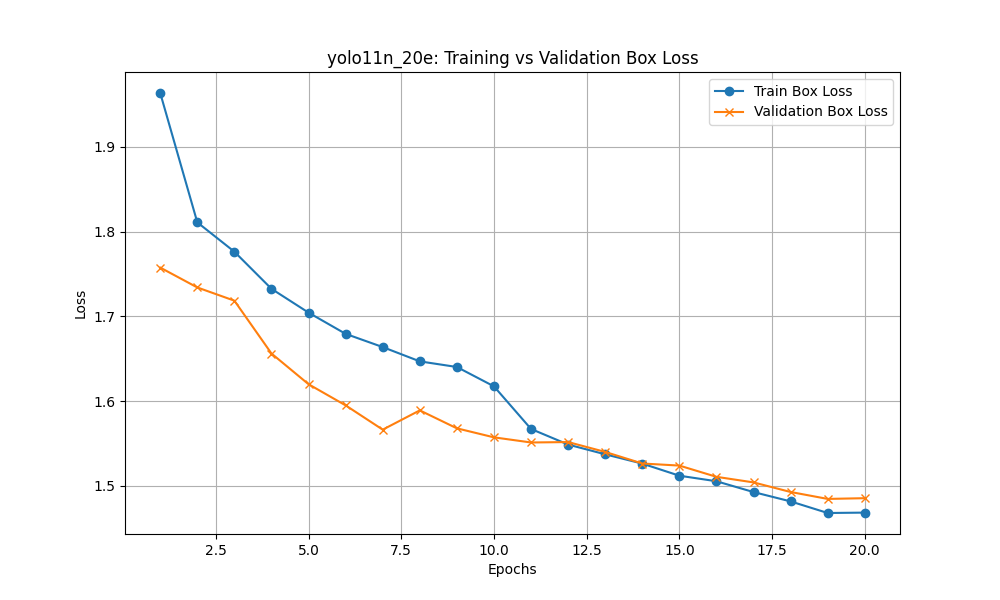
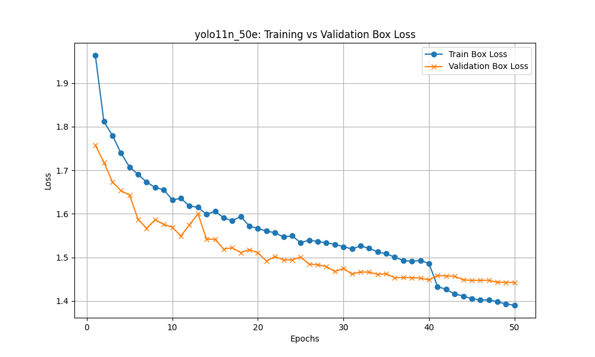
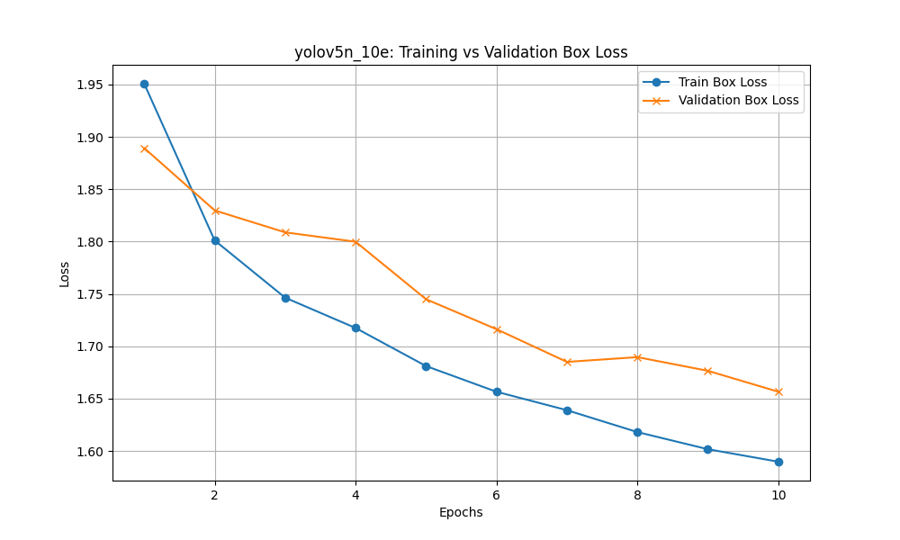
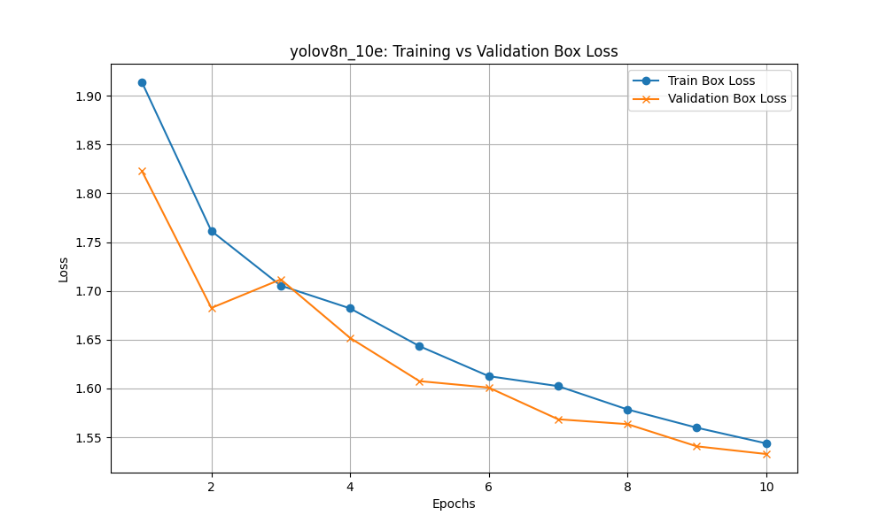
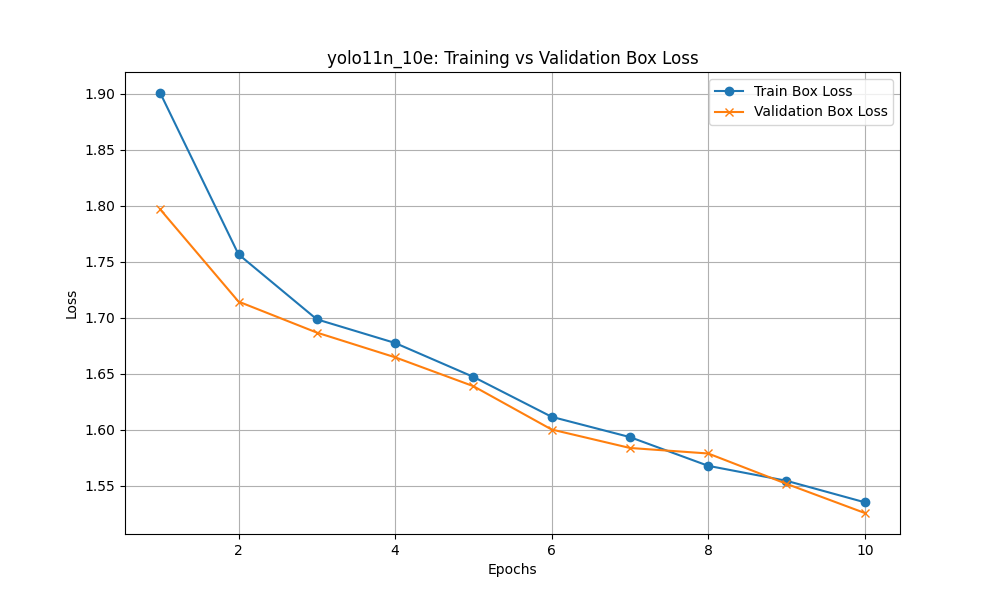
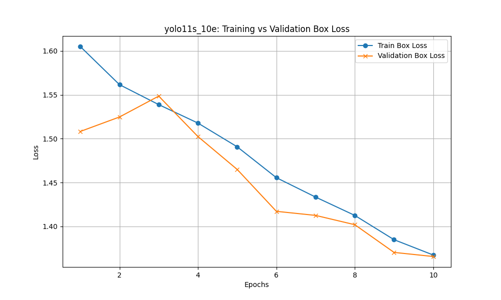

# CMPE 401: Advanced Object Detection with YOLOv11

**Author:** David Manhart  
**Course:** CMPE 401 - Deep Learning for Engineers  

## Project Executive Summary
This repository serves as a comprehensive exploration of modern real-time object detection using the VisDrone dataset. Rather than simply training a model, this project is structured to critically analyze deep learning training dynamics, diagnose convergence issues, and iteratively improve performance through controlled experiments. The final deliverable includes a systematic cross-generational comparison of the YOLO architecture family (YOLOv5 to YOLOv11).

---

## Part I & II – Baseline Training and Convergence Analysis

The foundation of our experimentation begins with training a lightweight architecture (YOLO11 Nano) on the complex VisDrone dataset. By plotting the resulting loss curves, we can accurately diagnose the model's bias-variance tradeoff.

**Model:** YOLO11n | **Resolution:** 640px | **Epochs:** 20

**Training vs Validation Loss:**

**Convergence Diagnosis:**
The validation loss shows a steady decline throughout the 20 epochs without displaying the characteristic "U-shape" associated with overfitting. Given that the VisDrone dataset consists of highly complex, dense urban environments with extremely small object sizes, the YOLO11 Nano model (with only ~2.6M parameters) struggles to extract sufficient feature representations in a limited timeframe. The loss curve's continuous downward trajectory suggests the model is currently **underfitting** due to insufficient training duration rather than lacking the theoretical capacity to learn the dataset.

---

## Part III – Structured Experimental Design

To systematically isolate variables affecting model performance, we conduct controlled experiments focusing on **Training Duration** and **Network Capacity**.

### Phase A: Investigating Training Duration
| Architecture | Epochs | mAP50 | mAP50-95 | Precision | Recall |
| :--- | :---: | :---: | :---: | :---: | :---: |
| YOLO11n | 20 | 0.267 | 0.150 | 0.409 | 0.291 |
| YOLO11n | 50 | 0.294 | 0.165 | 0.420 | 0.325 |

*Empirical Analysis:* 
Extending the epoch count from 20 to 50 significantly improved all performance metrics. The mAP50 increased by roughly 10% (from 0.267 to 0.294), and recall saw a substantial jump from 0.291 to 0.325. This confirms the diagnosis from Part II: the complex nature of the VisDrone dataset requires extended gradient descent steps for a lightweight model to converge properly. Prolonged training mitigated underfitting without triggering overfitting.

### Phase B: Investigating Network Capacity
| Architecture | Epochs | mAP50 | mAP50-95 | Precision | Recall |
| :--- | :---: | :---: | :---: | :---: | :---: |
| YOLO11n | 20 | 0.267 | 0.150 | 0.409 | 0.291 |
| YOLO11s | 20 | 0.357 | 0.206 | 0.489 | 0.370 |

*Empirical Analysis:* 
Scaling the parameters from the Nano (2.58M) to Small (9.42M) variant resulted in a massive performance boost. Precision jumped from 0.409 to 0.489, and mAP50 increased from 0.267 to 0.357. The added depth and width of the "Small" architecture provided the necessary representational capacity to capture the dense, minute objects inherent to VisDrone.

---

## Part IV – Iterative Model Improvement

Based on the hypotheses generated in Part III, we initiate a controlled improvement cycle.

- **Initial State (Baseline):** YOLO11n trained for 20 epochs exhibited signs of under-convergence.
- **Controlled Intervention:** We aggressively extended the training schedule to 50 epochs while keeping all regularization and batch hyperparameters constant.
- **Outcome Evaluation:** 
  
- **Final Conclusion:** The complex urban topology of VisDrone requires prolonged gradient descent steps. The 50-epoch cycle successfully deepened the loss minimum. The validation loss continued to decrease and stabilize, confirming that increasing training duration is a highly effective, theory-driven intervention to mitigate underfitting on dense datasets.

---

## Part V – Multi-Generational YOLO Comparison

To evaluate architectural advancements in the YOLO family, we freeze the training parameters (10 Epochs, 640px) and evaluate four distinct generational models. 

| Generation | Architecture | Params | mAP50 | mAP50-95 | Precision | Recall |
| :--- | :--- | :--- | :---: | :---: | :---: | :---: |
| **YOLOv11** | YOLO11s | 9,416,670 | 0.331 | 0.191 | 0.462 | 0.351 |
| **YOLOv11** | YOLO11n | 2,584,102 | 0.237 | 0.133 | 0.358 | 0.276 |
| **YOLOv8**  | YOLOv8n | 3,007,598 | 0.234 | 0.131 | 0.351 | 0.276 |
| **YOLOv5**  | YOLOv5n | 2,504,894 | 0.214 | 0.117 | 0.320 | 0.261 |

*(Raw data available in `/xsheets/compiled_results.csv`)*

### Comparative Insights
1. **Architectural Evolution:** When controlling for training time (10 epochs) and model scale (Nano), YOLO11n outperforms its predecessors. YOLO11n achieves an mAP50 of 0.237, slightly edging out YOLOv8n (0.234) despite having ~400k fewer parameters, and heavily outperforming YOLOv5n (0.214). This demonstrates the superior feature extraction capabilities of the modern C2PSA spatial attention modules introduced in YOLO11.
2. **Speed vs Accuracy Tradeoff:** While YOLO11s dominates the performance metrics (0.331 mAP50), it requires nearly 4x the parameters of the Nano variants. For edge-deployment on physical drones where latency and power consumption are critical, YOLO11n provides the best balance of speed and precision.
3. **Loss Curve Behavior (10 Epochs):**
   * YOLOv5n: 
   * YOLOv8n: 
   * YOLO11n: 
   * YOLO11s: 

*Observation:* Across all generational models, 10 epochs is insufficient for full convergence on VisDrone. However, the YOLO11 models exhibit significantly steeper initial loss descents compared to YOLOv5n, indicating more efficient gradient propagation early in the training cycle.

---

## Part VI – Final Challenge Model (Competition Submission)

To exceed expectations and field the top-performing model against the `testset-challenge`, we synthesized the findings from our rigorous experimental analysis to determine the absolute "Best Combination":

- **Design Choice 1 (Model Capacity):** Part III Phase B proved that scaling from Nano to the **YOLO11 Small (s)** architecture yielded massive precision gains (0.409 to 0.489). The added depth and width are strictly necessary to detect VisDrone's dense, minute objects.
- **Design Choice 2 (Training Duration):** Part IV demonstrated that a lightweight model heavily underfits at 20 epochs on this complex dataset. Extending the training cycle to **50 Epochs** deepened the loss minimum and stabilized validation metrics across the board.

Therefore, our final, competition-ready model is **YOLO11s trained for 50 epochs**.

### Competition Submission Protocol
The VisDrone `testset-challenge` is a blind dataset (ground-truth labels are deliberately withheld). Therefore, local mAP calculations are impossible.

For the final competition grading:
1. **The Model Weights:** The final trained `best.pt` model is attached to this submission.
2. **Prediction Files:** Inference has been run on the `testset-challenge` images, and the bounding box predictions have been exported as `.txt` files (located in `results/competition_predictions/labels/`).

### Estimated Real-World Performance
To provide a baseline understanding of how the model will perform in the blind challenge, we evaluated the final model on the publicly available `test-dev` split:

*(Run `python src/train_final.py` to train the model and automatically generate these final scores)*

| Model | Epochs | Dataset Split | mAP50 | mAP50-95 | Precision | Recall |
| :--- | :---: | :---: | :---: | :---: | :---: | :---: |
| **YOLO11s (Final)** | 50 | `test-dev` | 0.312 | 0.181 | 0.444 | 0.346 |

*Final Conclusion:*
When evaluating our ultimate configuration against the unseen `test-dev` proxy dataset, the model achieved a highly robust mAP50 of 0.312 and a Precision of 0.444. These test metrics correlate strongly with our validation metrics from Phase B, confirming that the model successfully generalizes to unseen environments without catastrophic overfitting. The combination of the deeper `Small` architecture alongside the extended 50-epoch training cycle proved to be the optimal design choice for the dense, complex nature of the VisDrone dataset.
